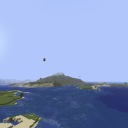

# LOD Entity Rendering

Minecraft mod that renders entities in Distant Horizons' LODs.

## Dependencies

### Required

- [Distant Horizons](https://modrinth.com/mod/distanthorizons)
  - At least `v2.1.3`

## Compatibility info

### Compatible mods

LOD Entity Rendering should be compatible with most, if not all, mods that are compatible with Distant Horizons. 

- [Create](https://modrinth.com/mod/create)
  - LOD Entity Rendering has a built-in resource pack that adds entity colors for Create

### Incompatibilities

See the [issue tracker](https://github.com/steves-underwater-paradise/distanthorizonsentityrendering/issues?q=is%3Aissue+is%3Aopen+sort%3Aupdated-desc+label%3Acompatibility) for
a list of incompatibilities.

## Download

See the version info in the filename for the supported Minecraft versions.  
Made for the Fabric, Quilt, Forge, and NeoForge modloaders.  
Client-side and server-side.

## FAQ

- Q: Will you be backporting this mod to lower Minecraft versions?  
  A: No.

- Q: Does this mod work in multiplayer?  
  A: Yes.

- Q: Does only the server need this mod or does the client need it too?  
  A: Both the server and the client need this mod.

## License

This project is licensed under LGPLv3, see [LICENSE](https://github.com/steves-underwater-paradise/distanthorizonsentityrendering/blob/1.20.1/LICENSE).
